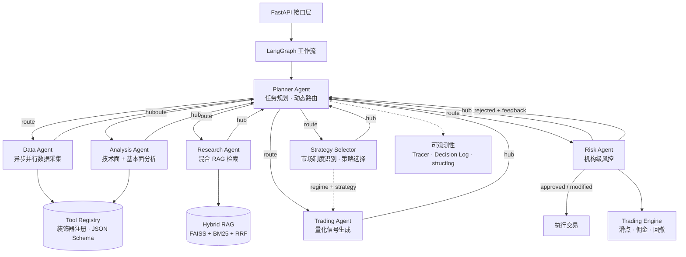

# Multi-Agent Financial Research & Trading Simulation System

**基于 LLM 的多智能体金融研究与交易仿真系统** — 7 个专业 Agent 协作完成从数据采集、研究分析、策略选择、信号生成到风控执行的完整投研链路，支持实时分析与历史回测。

> LangGraph · FastAPI · OpenAI GPT-4o · FAISS + BM25 · Pydantic v2

---

## 系统架构



### Hub-and-Spoke 模式

所有 Agent 执行完毕后返回 **Planner**，由 Planner 动态决定下一步路由。Risk Agent 拒绝信号时，Planner 携带结构化反馈重新路由至 Trading Agent，最多循环 3 次。

### 决策管线

```
Data → Research → Analysis → Strategy Selector → Trading → Risk → Execute
                                    ↑                         |
                                    └──── rejected feedback ──┘
```

---

## Agent 一览

| Agent | 角色 | 类型 |
|-------|------|------|
| **Planner** | 任务分解、动态路由、失败重试 | LLM + 规则 |
| **Data Agent** | 并行异步获取价格、历史、新闻、公司概况 | 工具调用 |
| **Research Agent** | 混合 RAG（向量 + BM25 + 时间衰减）语义检索 | LLM + 检索 |
| **Analysis Agent** | RSI、MACD、SMA、Bollinger 等技术指标 + LLM 综合研判 | LLM + 工具 |
| **Strategy Selector** | 市场制度识别（趋势/震荡/突破）→ 策略推荐 + 再入场检测 | **纯规则引擎** |
| **Trading Agent** | 量化策略师：按制度约束生成 BUY/SELL/HOLD 信号 | LLM |
| **Risk Agent** | 机构级风控：approve / reject / modify，自动缩仓 + 收紧止损 | 规则引擎 |

---

## 核心特性

### 策略选择层（Strategy Selector）

在 Analysis 和 Trading 之间新增的**纯规则引擎**，零 LLM 调用开销：

- **市场制度识别** — 5 个维度（MA 对齐、RSI 区间、MACD 方向、Bollinger 位置、价格动量）投票确定 `trend_up` / `trend_down` / `range` / `breakout`
- **策略映射** — 趋势行情 → momentum，震荡行情 → mean_reversion，突破行情 → breakout
- **再入场逻辑** — 空仓时检测 V 型反转信号（RSI 恢复 + MACD 转正 + 回到 SMA-20 上方），允许以保守仓位重新入场

### 量化交易决策

Trading Agent 采用专业量化策略师 prompt：

- **必须遵循** Strategy Selector 推荐的策略方向
- 信号强度校准：strong → 0.7–0.9 / moderate → 0.55–0.7 / weak → 0.4–0.55
- 止损止盈使用**绝对价格**（基于波动率和 Bollinger bands）
- 每条 reason 必须引用具体指标数值

### 机构级风控

Risk Agent 行为类似机构风控台（approve / reject / modify 三态）：

- **weak 信号直接拒绝** — 不交易模糊信号
- **high risk 自动修改** — 缩减仓位 40%，收紧止损 30%
- **超仓位智能调整** — 自动计算合规仓位而非简单拒绝
- 修改后的参数**回写至 trade_signal** 供执行引擎使用

### 更多特性

- **动态工作流** — LangGraph StateGraph + 条件边 + 闭环重试
- **工具注册表** — `@register_tool` 装饰器，JSON Schema 描述，异步执行
- **混合 RAG** — FAISS 向量检索 + BM25 关键词检索 + 倒数排名融合 + 时间衰减评分
- **交易仿真** — 滑点模型 + 固定/比例佣金 + Kelly 仓位管理 + 最大回撤追踪
- **可观测性** — Span 级执行追踪 + 决策链日志 + structlog JSON 结构化日志
- **回测引擎** — 逐日模拟 + 每日决策记录 + Buy & Hold 基准对比 + Sharpe / Win Rate / Signal Accuracy
- **记忆系统** — 短期（滑动窗口）+ 长期（SQLite：决策 + 市场趋势）
- **全链路异步** — httpx (API) + aiosqlite (持久化) + async Agent 执行

---

## 快速开始

### 前置条件

- Python 3.10+（推荐 3.12）
- API Key：OpenAI、Alpha Vantage（免费）、Finnhub（免费）

### 安装

```bash
git clone <repo-url> && cd multi-agent-financial-research
cp .env.example .env   # 填入你的 API Key
pip install -e ".[dev]"
```

### 运行

```bash
# 启动 API 服务
uvicorn src.api.main:app --reload

# 或通过 Make
make run
```

### 测试

```bash
# 48 个单元测试 + 集成测试
pytest tests/ -v

# 真实 API 冒烟测试（需要配置 .env）
python tests/live_smoke_test.py

# 决策级回测（最近 10 个交易日）
python scripts/decision_backtest.py
```

---

## API 接口

| 方法 | 路径 | 说明 |
|------|------|------|
| `POST` | `/api/v1/analyze` | 运行完整多 Agent 管线分析一只股票 |
| `GET` | `/api/v1/trace/{id}` | 获取 Span 级执行追踪详情 |
| `POST` | `/api/v1/trade` | 手动执行模拟交易 |
| `GET` | `/api/v1/portfolio` | 当前组合状态 + PnL + 最大回撤 |
| `GET` | `/api/v1/portfolio/history` | 组合价值快照（用于图表） |
| `POST` | `/api/v1/backtest` | 在历史数据上回测管线 |
| `GET` | `/health` | 健康检查 |

### 示例：分析一只股票

```bash
curl -X POST http://localhost:8000/api/v1/analyze \
  -H "Content-Type: application/json" \
  -d '{"symbol": "AAPL"}'
```

```json
{
  "symbol": "AAPL",
  "trade_signal": {
    "action": "HOLD",
    "confidence": 0.45,
    "strategy": "neutral",
    "signal_strength": "weak",
    "reason": "RSI at 50.35 indicates no momentum, MACD negative, no clear edge",
    "risk": "medium",
    "stop_loss": 243.12,
    "take_profit": 281.51
  },
  "risk_assessment": {
    "approved": true,
    "decision": "approved",
    "risk_score": 0.0,
    "adjustments": {},
    "notes": "HOLD signal — no risk to assess"
  },
  "analysis": {
    "technical_outlook": "neutral",
    "sentiment": "neutral",
    "strategy_context": {
      "regime": "range",
      "recommended_strategy": "mean_reversion",
      "re_entry_eligible": false
    }
  },
  "trace_id": "a1b2c3d4-..."
}
```

---

## 回测结果

最近一次回测（AAPL, 10 个交易日, $100,000 初始资金）：

| 指标 | 值 |
|------|-----|
| Agent Return | +0.14% |
| Max Drawdown | 0.01% |
| Sharpe Ratio | 5.43 |
| Win Rate | 100% |
| 交易次数 | 1 |

系统在下跌行情中识别 `trend_down → momentum` 制度保持空仓，在反弹切换到 `range → mean_reversion` 后通过 re-entry 检测果断买入，最终盈利。

---

## 项目结构

```
src/
├── agents/
│   ├── base.py               # BaseAgent ABC + AgentState TypedDict
│   ├── planner.py             # 元 Agent：动态路由 + 任务规划
│   ├── data_agent.py          # 异步并行数据采集
│   ├── research_agent.py      # 混合 RAG 研究
│   ├── analysis_agent.py      # 技术面 + 基本面分析
│   ├── strategy_selector.py   # 市场制度识别 + 策略选择 + 再入场检测
│   ├── trading_agent.py       # 量化信号生成
│   ├── risk_agent.py          # 机构级风控（approve/reject/modify）
│   └── workflow.py            # LangGraph Hub-and-Spoke 工作流
├── api/
│   ├── main.py                # FastAPI 应用
│   ├── dependencies.py        # 单例工厂
│   └── routes/                # analyze, trade, portfolio, backtest
├── backtesting/
│   └── engine.py              # BacktestEngine（逐日模拟）
├── core/
│   ├── config.py              # Pydantic Settings（.env 配置）
│   └── logging.py             # structlog 初始化
├── models/
│   └── schemas.py             # 所有 Pydantic 模型 + 枚举
├── observability/
│   ├── tracer.py              # ExecutionTracer（Span 生命周期）
│   ├── decision_log.py        # DecisionLogger（SQLite 持久化）
│   └── logger.py              # Agent 上下文绑定
├── services/
│   ├── evaluation.py          # 评估引擎 + 基准对比
│   ├── memory.py              # 短期 + 长期记忆
│   ├── rag.py                 # VectorStore + BM25 + HybridRetriever
│   └── trading_engine.py      # 滑点、佣金、仓位管理、持久化
└── tools/
    ├── registry.py            # ToolRegistry + @register_tool
    ├── market_data.py         # Alpha Vantage（价格 + 历史）
    ├── news.py                # Finnhub（新闻 + 情绪）
    ├── indicators.py          # RSI, MACD, SMA, EMA, Bollinger
    └── portfolio.py           # 组合查询工具

scripts/
└── decision_backtest.py       # 决策级回测脚本

tests/
├── conftest.py
├── unit/                      # 工具、注册表、引擎、记忆、评估、追踪
├── integration/               # API 端点集成测试
└── live_smoke_test.py         # 真实 API 冒烟测试
```

---

## 技术栈

| 组件 | 技术 |
|------|------|
| Agent 编排 | LangGraph（StateGraph + 条件边 + 循环） |
| LLM | OpenAI GPT-4o / GPT-4o-mini |
| Embeddings | text-embedding-3-small |
| API | FastAPI + Uvicorn |
| RAG | FAISS（向量）+ BM25（关键词）+ RRF + 时间衰减 |
| 数据校验 | Pydantic v2 |
| HTTP | httpx（异步） |
| 数据库 | aiosqlite（SQLite） |
| 日志 | structlog（JSON 结构化） |
| 行情数据 | Alpha Vantage, Finnhub |
| 测试 | pytest + pytest-asyncio + respx |
| 容器化 | Docker（多阶段构建） |

---

## Author

**Jackson Liu**

## License

MIT
