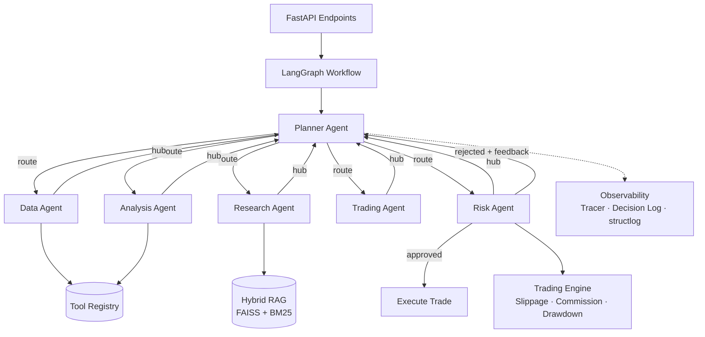

# Multi-Agent Financial Research & Trading Simulation System

A **production-grade** multi-agent system that uses LLM-powered agents to research stocks, generate trading signals, and simulate trades — with dynamic orchestration, hybrid RAG, and full observability.

> Built with LangGraph · FastAPI · OpenAI · FAISS + BM25 · Pydantic v2

---

## Architecture



### Hub-and-Spoke Pattern

Every agent returns control to the **Planner**, which dynamically decides the next step. If the Risk Agent rejects a signal, the Planner re-routes to the Trading Agent with structured feedback — up to 3 iterations.

## Agents

| Agent | Role |
|-------|------|
| **Planner** | Meta-agent: decomposes tasks, routes dynamically, handles re-tries |
| **Data Agent** | Parallel async fetch of prices, history, news, fundamentals |
| **Research Agent** | Hybrid RAG (vector + BM25 + time-decay) for context retrieval |
| **Analysis Agent** | Technical indicators (RSI, MACD, SMA, Bollinger) + LLM synthesis |
| **Trading Agent** | Generates BUY/SELL/HOLD signals with confidence, stop-loss, take-profit |
| **Risk Agent** | Validates signals: position limits, drawdown, funds, concentration |

## Features

- **Dynamic Workflow** — Closed-loop orchestration with conditional re-routing via LangGraph
- **Tool Registry** — Decorator-based registration with JSON schemas and async execution
- **Hybrid RAG** — FAISS vector search + BM25 keyword search with Reciprocal Rank Fusion and time-decay scoring
- **Trading Realism** — Slippage model, per-trade + percentage commissions, Kelly-inspired position sizing, max drawdown tracking
- **Observability** — Execution traces (span-level), decision chain logging, structured JSON logs with agent context
- **Backtesting** — Day-by-day simulation over historical data with buy-and-hold baseline comparison
- **Memory** — Short-term (sliding window) + Long-term (SQLite: decisions + market trends)
- **Async Throughout** — httpx for API calls, aiosqlite for persistence, async agent execution

## Quick Start

### Prerequisites

- Python 3.10+
- API keys: OpenAI, Alpha Vantage (free), Finnhub (free)

### Install

```bash
git clone <repo-url> && cd multi-agent-financial-research
cp .env.example .env   # Fill in API keys
pip install -e ".[dev]"
```

### Run

```bash
# Start the API server
uvicorn src.api.main:app --reload

# Or via Make
make run
```

### Test

```bash
pytest tests/ -v

# With coverage
make test
```

## API Endpoints

| Method | Path | Description |
|--------|------|-------------|
| `POST` | `/api/v1/analyze` | Run full multi-agent pipeline for a symbol |
| `GET` | `/api/v1/trace/{id}` | Get execution trace with span-level details |
| `POST` | `/api/v1/trade` | Execute a manual trade on the simulation |
| `GET` | `/api/v1/portfolio` | Current portfolio state + PnL + max drawdown |
| `GET` | `/api/v1/portfolio/history` | Portfolio value snapshots for charting |
| `POST` | `/api/v1/backtest` | Backtest the pipeline over historical data |
| `GET` | `/health` | Health check |

### Example: Analyze a Stock

```bash
curl -X POST http://localhost:8000/api/v1/analyze \
  -H "Content-Type: application/json" \
  -d '{"symbol": "AAPL"}'
```

Response:
```json
{
  "symbol": "AAPL",
  "trade_signal": {
    "action": "BUY",
    "confidence": 0.75,
    "reason": "Strong RSI recovery from oversold + positive earnings sentiment",
    "risk": "medium",
    "stop_loss": 171.0,
    "take_profit": 198.0
  },
  "risk_assessment": {
    "approved": true,
    "risk_score": 0.15,
    "notes": "All risk checks passed"
  },
  "analysis": {
    "technical_outlook": "bullish",
    "sentiment": "bullish",
    "key_factors": ["Strong Q3 earnings", "RSI recovery", "Above 50-day SMA"]
  },
  "trace_id": "a1b2c3d4-..."
}
```

## Project Structure

```
src/
├── agents/
│   ├── base.py           # BaseAgent ABC + AgentState TypedDict
│   ├── planner.py        # Meta-agent: dynamic routing
│   ├── data_agent.py     # Async parallel data fetching
│   ├── research_agent.py # Hybrid RAG research
│   ├── analysis_agent.py # Technical + fundamental analysis
│   ├── trading_agent.py  # Signal generation
│   ├── risk_agent.py     # Risk validation
│   └── workflow.py       # LangGraph hub-and-spoke graph
├── api/
│   ├── main.py           # FastAPI app
│   ├── dependencies.py   # Singleton factories
│   └── routes/           # analyze, trade, portfolio, backtest
├── backtesting/
│   ├── engine.py         # BacktestEngine
│   └── data_loader.py    # Historical data loader
├── core/
│   ├── config.py         # Pydantic Settings
│   └── logging.py        # structlog setup
├── models/
│   └── schemas.py        # All Pydantic models + enums
├── observability/
│   ├── tracer.py         # ExecutionTracer (span lifecycle)
│   ├── decision_log.py   # DecisionLogger (SQLite)
│   └── logger.py         # Agent context binding
├── services/
│   ├── evaluation.py     # EvaluationEngine + baseline comparison
│   ├── memory.py         # Short-term + Long-term memory
│   ├── rag.py            # VectorStore + BM25 + HybridRetriever
│   └── trading_engine.py # Slippage, commission, position sizing
└── tools/
    ├── registry.py       # ToolRegistry + @register_tool decorator
    ├── market_data.py    # Alpha Vantage tools
    ├── news.py           # Finnhub news tools
    ├── indicators.py     # RSI, MACD, SMA, EMA, Bollinger
    └── portfolio.py      # Portfolio query tools
tests/
├── conftest.py
├── unit/                 # Tools, registry, engine, memory, evaluation, tracer
└── integration/          # API endpoint tests
```

## Tech Stack

| Component | Technology |
|-----------|-----------|
| Agent Orchestration | LangGraph (StateGraph, conditional edges, cycles) |
| LLM | OpenAI GPT-4o / GPT-4o-mini |
| Embeddings | text-embedding-3-small |
| API | FastAPI + Uvicorn |
| RAG | FAISS (vector) + BM25 (keyword) + RRF + time-decay |
| Data Validation | Pydantic v2 |
| HTTP | httpx (async) |
| Database | aiosqlite (SQLite) |
| Logging | structlog (JSON) |
| Market Data | Alpha Vantage, Finnhub |
| Testing | pytest + pytest-asyncio + respx |
| Containerization | Docker (multi-stage build) |

## License

MIT
